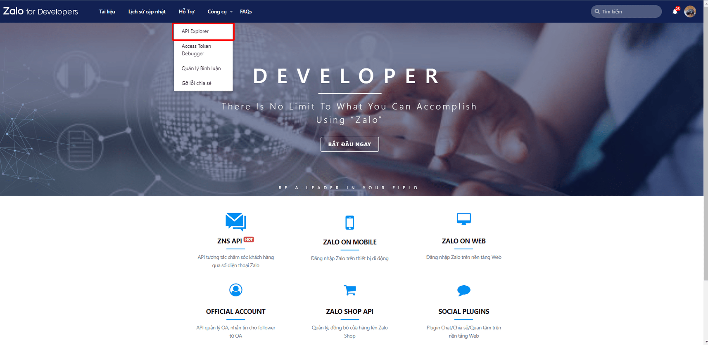
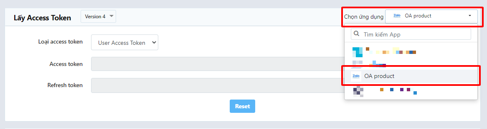
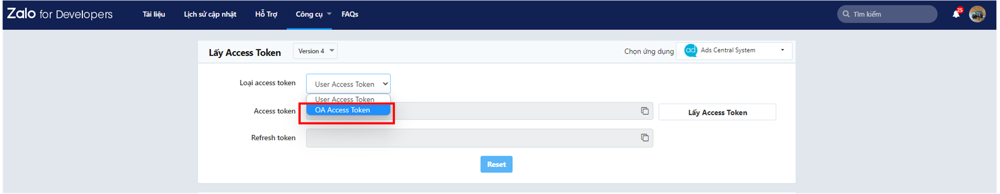
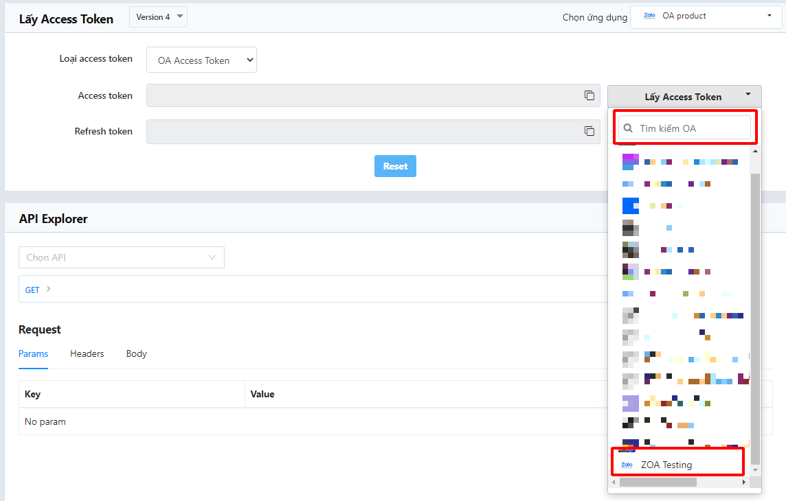
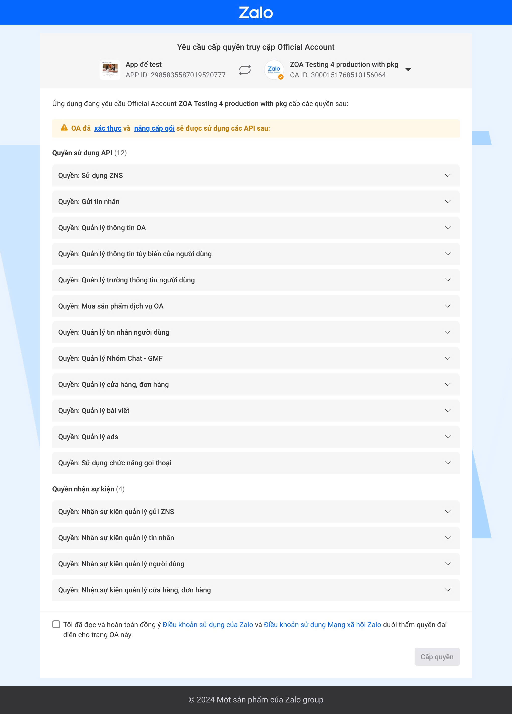
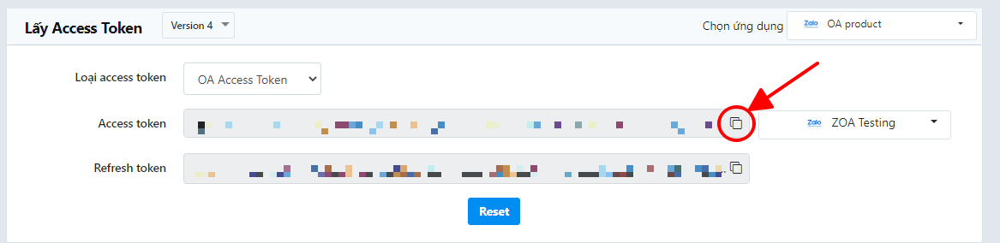
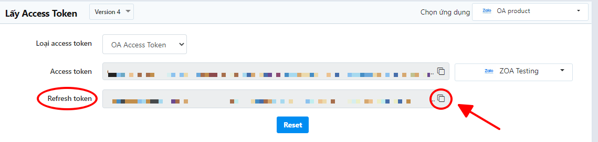
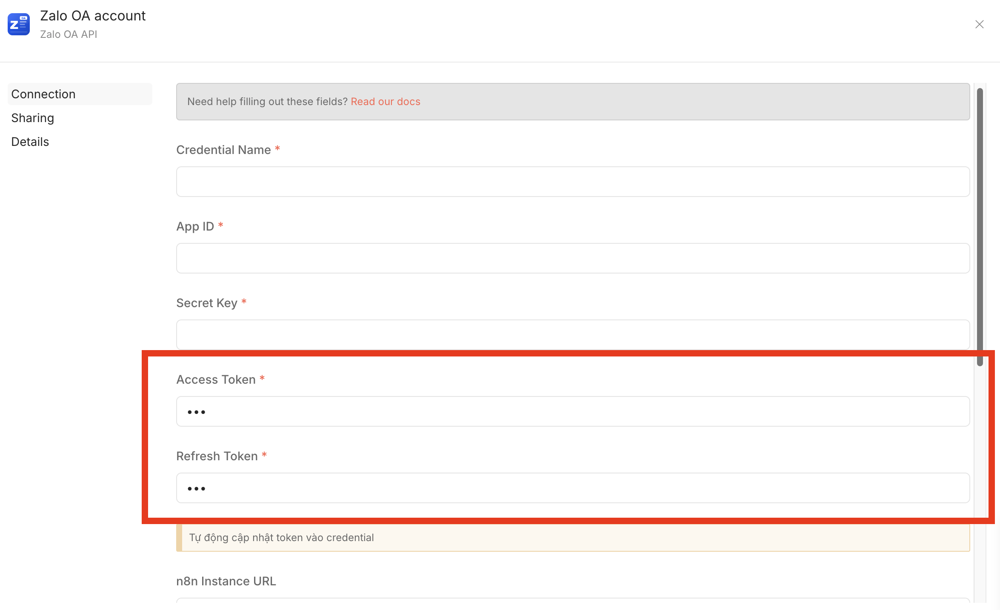

# @bautran1911/n8n-nodes-zalo-oa

**n8n community node** tích hợp **Zalo Official Account (Zalo OA)** vào workflow n8n — hỗ trợ **Webhook Trigger** nhận tin nhắn từ người dùng, **gửi tin tư vấn (CS Message)** để tự động phản hồi chatbot AI, gửi **ZBS Template Message** qua số điện thoại và tự động quản lý Access Token.

[](https://www.npmjs.com/package/@bautran1911/n8n-nodes-zalo-oa)
[](https://opensource.org/licenses/MIT)
[](https://docs.n8n.io/integrations/community-nodes/)

---

## Mục lục

- [Giới thiệu](#giới-thiệu)
- [Cài đặt](#cài-đặt)
- [Cấu hình Credential](#cấu-hình-credential)
- [Lấy Access Token và Refresh Token từ Zalo](#lấy-access-token-và-refresh-token-từ-zalo)
  - [Cách 2: API Explorer (Khuyên dùng)](#cách-2-sử-dụng-api-explorer-khuyên-dùng)
  - [Cách 1: OAuth v4 (Tích hợp hệ thống)](#cách-1-sử-dụng-oauth-v4-tích-hợp-hệ-thống)
- [Operations](#operations)
- [Ví dụ sử dụng](#ví-dụ-sử-dụng)
- [Compatibility](#compatibility)
- [Tài nguyên](#tài-nguyên)
- [Tác giả](#tác-giả)
- [☕ Ủng hộ tác giả](#-ủng-hộ-tác-giả)

---

## Giới thiệu

**Zalo OA** là Trang Zalo Official Account — nền tảng nhắn tin của Zalo dành cho doanh nghiệp. Package này cung cấp **2 node**:

1. **Zalo OA** (action node) — gọi các API của Zalo OpenAPI / Zalo Business Solution (ZBS).
2. **Zalo OA Trigger** (webhook trigger) — nhận sự kiện webhook từ Zalo OA để khởi động workflow (chatbot AI, auto-reply, phân loại tin nhắn...).

Tính năng chính:

- ⚡ **Webhook Trigger**: Nhận realtime các sự kiện `user_send_text/image/link/audio/video/sticker/location/file/gif`, `follow`, `unfollow`, `user_submit_info`, `user_seen_message`,... Có xác thực chữ ký `X-ZEvent-Signature` và lọc event theo ý.
- 💬 **Gửi Tin Tư Vấn (CS Message)**: Gửi tin nhắn văn bản tự do tới user đã tương tác với OA trong vòng 7 ngày (dùng cho chatbot AI phản hồi).
- 📨 **ZBS Template Message**: Gửi tin mẫu đã duyệt qua số điện thoại.
- 👤 **Quản lý Người Dùng**: Truy xuất danh sách người quan tâm, chi tiết người dùng.
- 💭 **Quản lý Hội Thoại**: Đọc lịch sử tin nhắn đã trao đổi với khách hàng.
- 🏢 **Thông Tin OA**: Lấy profile Zalo Official Account.
- 🔄 **Tự động Refresh Access Token** khi hết hạn và ghi đè vào n8n credential.
- 🔐 Auto-retry khi hết hạn token (áp dụng cho các mã lỗi `-124`, `3`, `-216`, `-220`).

---

## Cài đặt

### Trong n8n (khuyên dùng)

1. Vào **Settings → Community Nodes**
2. Nhấn **Install**
3. Nhập `@bautran1911/n8n-nodes-zalo-oa`
4. Nhấn **Install** và khởi động lại n8n

### Thủ công (self-hosted)

```bash
npm install @bautran1911/n8n-nodes-zalo-oa
```

---

## Cấu hình Credential

Sau khi cài node, tạo credential **Zalo OA API** với các thông tin sau:

| Trường | Mô tả |
|--------|-------|
| **Credential Name** | Tên phân biệt credential này (ví dụ: `Zalo OA - Shop Thời Trang`) |
| **App ID** | Lấy tại [developers.zalo.me](https://developers.zalo.me) → App của bạn → App ID |
| **Secret Key** | Lấy tại [developers.zalo.me](https://developers.zalo.me) → App của bạn → Secret Key |
| **Access Token** | Xem hướng dẫn bên dưới |
| **Refresh Token** | Xem hướng dẫn bên dưới |
| **n8n Instance URL** | URL n8n của bạn, ví dụ: `http://localhost:5678` hoặc `https://n8n.example.com` |
| **n8n API Key** | Tạo tại n8n → **Settings → API → Create an API key** |
| **Credential ID** | Sau khi lưu credential, xem ID trên URL trình duyệt: `.../credentials/<ID>` |

---

## Lấy Access Token và Refresh Token từ Zalo

Zalo sử dụng OAuth2 kết hợp PKCE để cấp quyền. Có **2 cách** lấy token:

> 📌 **Thuật ngữ quan trọng:**
>
> - **Access Token:** Có hiệu lực **25 giờ**. Dùng để gọi API.
> - **Refresh Token:** Có hiệu lực **3 tháng**. Chỉ dùng **1 lần** để lấy Access Token mới (và sẽ nhận Refresh Token mới).
> - **Authorization Code:** Chỉ dùng **1 lần**, hết hạn sau **10 phút**.

---

### Cách 2: Sử dụng API Explorer (Khuyên dùng)

> 💡 **Phù hợp cho:** Admin của OA hoặc Admin của Ứng dụng muốn lấy token nhanh mà không cần cấu hình server.

**Các bước thực hiện:**

1. Truy cập **[Zalo API Explorer](https://developers.zalo.me/tools/explorer)**
   *(Vào Zalo for Developers → Công cụ & Hỗ trợ → API Explorer)*
   

2. Tại màn hình API Explorer, chọn **Ứng dụng** của bạn

   

3. Tại mục **Loại access token**, chọn **OA Access Token**

   

4. Chọn **Official Account (OA)** mà bạn muốn liên kết và cấp quyền

   

5. Hệ thống hiển thị trang yêu cầu cấp quyền → kiểm tra các quyền → nhấn **Cho phép**

   

6. Sau khi nhấn "Cho phép", công cụ hiển thị:
   - **Access Token** → nhấn biểu tượng 📋 Copy để lấy
   - **Refresh Token** → nhấn biểu tượng 📋 Copy để lưu lại

   
   

7. Dán **Access Token** và **Refresh Token** vào tương ứng trong credential n8n

   

> ⚠️ **Lưu ý:** Access Token từ API Explorer hết hạn sau **25 giờ**. Node sẽ tự động dùng Refresh Token để gia hạn khi phát hiện lỗi hết hạn (mã lỗi `-124` hoặc `3`).

---

### Cách 1: Sử dụng OAuth v4 (Tích hợp hệ thống)

> 💡 **Phù hợp cho:** Tích hợp tự động, cần lấy token theo dạng programmatic.

#### Bước 1 — Tạo App trên Zalo Developer

1. Đăng nhập tại [developers.zalo.me](https://developers.zalo.me)
2. Tạo ứng dụng mới → lấy **App ID** và **Secret Key**
3. Vào mục **Official Account → Liên kết OA** → liên kết OA của bạn với App
4. Thiết lập **Callback URL** trong phần cài đặt ứng dụng

#### Bước 2 — Tạo Code Verifier & Code Challenge (PKCE)

```bash
# Tạo code_verifier (chuỗi ngẫu nhiên)
code_verifier=$(openssl rand -base64 64 | tr -d '=+/' | cut -c1-64)

# Tạo code_challenge (SHA-256 + Base64 không padding)
code_challenge=$(echo -n "$code_verifier" | openssl sha256 -binary | base64 | tr '+/' '-_' | tr -d '=')
```

#### Bước 3 — Lấy Authorization Code

Gửi URL sau cho Admin OA để họ nhấn "Cho phép":

```
https://oauth.zaloapp.com/v4/oa/permission?app_id=YOUR_APP_ID&redirect_uri=YOUR_CALLBACK_URL&code_challenge=YOUR_CODE_CHALLENGE
```

Zalo sẽ redirect về Callback URL kèm mã `code`:

```
https://your-callback.com/callback?code=AUTHORIZATION_CODE
```

#### Bước 4 — Đổi Code lấy Tokens

```bash
curl -X POST https://oauth.zaloapp.com/v4/oa/access_token \
  -H "Content-Type: application/x-www-form-urlencoded" \
  -H "secret_key: YOUR_SECRET_KEY" \
  -d "app_id=YOUR_APP_ID&code=AUTHORIZATION_CODE&grant_type=authorization_code&code_verifier=YOUR_CODE_VERIFIER"
```

Response:

```json
{
  "access_token": "...",
  "refresh_token": "...",
  "expires_in": 90000
}
```

Copy `access_token` và `refresh_token` vào credential n8n.

#### Gia hạn Token bằng Refresh Token

```bash
curl -X POST https://oauth.zaloapp.com/v4/oa/access_token \
  -H "Content-Type: application/x-www-form-urlencoded" \
  -H "secret_key: YOUR_SECRET_KEY" \
  -d "app_id=YOUR_APP_ID&refresh_token=YOUR_REFRESH_TOKEN&grant_type=refresh_token"
```

> ✅ Node n8n đã tích hợp sẵn tính năng **tự động gia hạn token** — bạn không cần chạy lệnh trên thủ công. Xem phần [Operations → Refresh Token](#resource-token).

---

## Operations

### Resource: Thông Tin OA
- **Lấy Thông Tin OA**: Truy xuất profile chung của Zalo OA (OA ID, Tên, Avatar, Cover, Số người quan tâm, Tình trạng xác thực...).

### Resource: Hội Thoại (Conversation)
- **Lấy Chi Tiết Hội Thoại**: Lấy lịch sử và nội dung tin nhắn trao đổi giữa Zalo OA và Khách hàng (yêu cầu `User ID`). Cho phép phân trang thông qua `Offset` và `Count` (tối đa 10 tin/lần).

### Resource: Người Dùng (OA)
- **Truy Xuất Chi Tiết Người Dùng**: Nhận thông tin đầy đủ về một người dùng (tên, ảnh, trạng thái theo dõi, thiết lập riêng...) theo `User ID`.
- **Truy Xuất Danh Sách Người Dùng**: Thiết lập lấy danh sách kèm bộ lọc đa dạng (Offset, Count, Tag ID, Tương tác gần nhất TODAY/L7D/L30D, Is Follower).

### Resource: Tin Tư Vấn (CS Message)

**Gửi Tin Tư Vấn Dạng Văn Bản** — gửi tin nhắn văn bản tới một người dùng cụ thể thông qua `user_id`. Dùng cho workflow **chatbot AI** phản hồi lại tin nhắn khách gửi vào OA.

| Tham số | Bắt buộc | Mô tả |
|---------|----------|-------|
| **User ID** | ✅ | Zalo User ID của người nhận — lấy trực tiếp từ output `user_id` của **Zalo OA Trigger** |
| **Nội Dung Văn Bản** | ✅ | Nội dung tin nhắn văn bản (tối đa 500 ký tự theo Zalo) |

> ⚠️ Điều kiện Zalo: chỉ gửi được tới user đã tương tác với OA trong **7 ngày** gần nhất. API endpoint: `POST https://openapi.zalo.me/v3.0/oa/message/cs` — xem [tài liệu Zalo](https://developers.zalo.me/docs/official-account/tin-nhan/tin-tu-van/gui-tin-tu-van-dang-van-ban).

### Resource: Tin Nhắn ZBS Template

**Gửi ZBS Template Message** qua số điện thoại người nhận.

| Tham số | Bắt buộc | Mô tả |
|---------|----------|-------|
| **Số Điện Thoại Người Nhận** | ✅ | Định dạng quốc tế, ví dụ: `84987654321` |
| **Template ID** | ✅ | ID template đã được phê duyệt trên Zalo OA |
| **Dữ Liệu Template (JSON)** | ✅ | Object JSON chứa các biến của template |
| **Tracking ID** | ❌ | Mã theo dõi tuỳ chỉnh (tối đa 48 ký tự) |
| **Chế Độ Gửi** | ❌ | `Gửi Thường` (trong hạn mức) hoặc `Gửi Vượt Hạn Mức` |

### Resource: Token

**Refresh Token** — Làm mới Access Token từ Refresh Token và tự động ghi đè vào credential.

Sử dụng khi muốn chủ động làm mới token (ví dụ: chạy định kỳ mỗi 5 ngày).

---

## ⚠️ Lưu ý: Giới hạn tốc độ gọi API (Rate Limit)

Zalo OA áp dụng các giới hạn tốc độ gọi API (Rate Limit) riêng nhằm duy trì ổn định hệ thống. Việc gọi API với tần suất quá cao (ví dụ: chạy qua Loop/Split in Batches tốc độ cao trong n8n) có thể làm ứng dụng vượt mức cho phép, kết quả là bạn sẽ nhận cảnh báo lỗi (Mã lỗi thông thường là `-32`).

- **Gửi tin nhắn**: Bị giới hạn tương ứng với loại OA và quỹ tin nhắn.
- **Truy xuất thông tin người dùng/Hội thoại**: Mức giới hạn quy định số request được phép trong 1 giây/phút/ngày.

👉 Tham khảo chi tiết các hạn mức: [Giới hạn tốc độ gọi API (Zalo for Developers)](https://developers.zalo.me/docs/official-account/phu-luc/gioi-han-toc-do-api)

💡 **Mẹo khi dùng n8n:**
- Nếu bạn xử lý hàng loạt người dùng/tin nhắn, hãy tích hợp thêm node **Wait** (hoặc cấu hình Batches) để tạo độ trễ (delay) hợp lý giữa các lần gọi API, tránh rủi ro bị chặn bởi Zalo.

---

## Ví dụ sử dụng

### Gửi thông báo đặt hàng thành công

**Template Data:**

```json
{
  "customer_name": "Nguyễn Văn A",
  "order_id": "DH-2024-001",
  "total_amount": "500.000đ",
  "delivery_date": "10/04/2024"
}
```

**Cấu hình node:**

- **Số Điện Thoại:** `84987654321`
- **Template ID:** `123456`
- **Dữ Liệu Template:** JSON ở trên

### Tự động refresh token mỗi 5 ngày

Tạo workflow với:

1. **Schedule Trigger** → mỗi 5 ngày lúc 3:00 sáng
2. **Zalo OA node** → Resource: `Token` → Operation: `Refresh Token`

---

## Compatibility

| Phiên bản | Trạng thái |
|-----------|-----------|
| n8n ≥ 1.0.0 | ✅ Tương thích |
| Node.js ≥ 22 | ✅ Tương thích |

---

## Tài nguyên

- [Tài liệu Zalo ZBS API](https://developers.zalo.me/docs/zbs-template-message/)
- [Zalo OA API Reference](https://developers.zalo.me/docs/official-account/)
- [n8n Community Nodes Docs](https://docs.n8n.io/integrations/community-nodes/)
- [GitHub Repository](https://github.com/bautran1911/n8n-nodes-zalo-oa)

---

## Tác giả

**Báu Đẹp Trai**  
📧 [bautran1911@gmail.com](mailto:bautran1911@gmail.com)  
🐙 [github.com/bautran1911](https://github.com/bautran1911)

---

## ☕ Ủng hộ tác giả

Nếu node này giúp ích cho công việc của bạn, hãy ủng hộ tác giả một ly cà phê để tiếp tục phát triển và duy trì dự án! 🙏

### 🏦 Chuyển khoản ngân hàng (Việt Nam)

| Thông tin | Chi tiết |
|-----------|----------|
| **Ngân hàng** | MB Bank (Ngân Hàng Quân Đội) |
| **Số tài khoản** | `0930113997979` |
| **Chủ tài khoản** | TRAN NGOC BAU |
| **Nội dung CK** | `donate n8n zalo oa` |

### 📱 Quét QR để chuyển khoản nhanh

<p align="center">
  
</p>
<p align="center">
  <em>MB Bank</em>
</p>

> 💡 Bạn cũng có thể dùng **MoMo**, **ZaloPay**, hoặc **VietQR** để chuyển khoản nhanh qua số tài khoản trên.

---

## Version History

### v1.0.13 (2026-04)

- 🚀 Thêm API: Lấy thông tin Zalo Official Account
- 🚀 Thêm API: Lấy danh sách người dùng & chi tiết người dùng
- 🚀 Thêm API: Lấy thông tin tin nhắn trong một hội thoại
- 🔄 Bổ sung hỗ trợ tự động Refresh Token với các mã lỗi `-216`, `-220` (bên cạnh `-124`, `3`)
- ⚠️ Cập nhật cảnh báo Giới hạn tốc độ gọi API (Rate Limit) cho n8n workflow

### v1.0.9 (2026-04)

- 🎉 Ra mắt lần đầu
- ✅ Gửi ZBS Template Message qua số điện thoại
- ✅ Tự động Refresh Access Token khi hết hạn
- ✅ Ghi đè token mới vào n8n credential qua REST API
